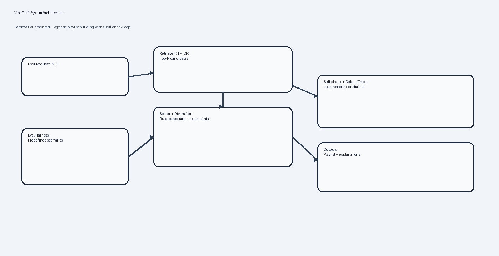

# VibeCraft: Agentic Playlist Builder (Applied AI System)

## Links

- Code (GitHub): https://github.com/ruby-1550/applied-ai-system-project
- Demo: https://youtu.be/Wc9yYRMbnpQ

## Original project (Modules 1–3)

This repo started as my **Music Recommender Simulation**: a transparent, rule-based content recommender that scores songs from `data/songs.csv` against a user taste profile (genre, mood, and numeric “vibe” features), then ranks and returns the top‑K.

## What I built for the final project

**VibeCraft** extends that prototype into an end‑to‑end applied AI system that:
- Takes a **natural‑language request** (ex: “chill lofi for studying, avoid pop”)
- Uses **retrieval** (TF‑IDF over song metadata) to narrow to relevant candidates
- Runs an **agentic workflow** (plan → retrieve → score/diversify → self‑check) to generate a playlist with explanations
- Includes **reliability testing** (unit tests + an evaluation harness with predefined scenarios)

## Architecture



Key modules:
- `src/retrieval.py`: TF‑IDF retrieval (no external vector DB)
- `src/vibecraft.py`: agent loop + logging + guardrails
- `src/eval_harness.py`: reliability checks on predefined cases
- `src/streamlit_app.py`: small UI for demoing outputs and the debug trace

## Setup

```bash
python3 -m venv .venv
source .venv/bin/activate
pip install -r requirements.txt
```

## Run (CLI)

Original project behavior:
```bash
python3 -m src.main
```

VibeCraft (natural language):
```bash
python3 -m src.main --query "chill lofi for studying, avoid pop" --k 8 --debug
```

## Run (Streamlit)

```bash
streamlit run src/streamlit_app.py
```

## Sample interactions

Input:
- `chill lofi for studying, avoid pop`

Output (example):
- A playlist of 8 tracks with per‑track explanations (feature matches + similarity + diversity constraints)

Input:
- `uplifting workout music 10 songs`

Output (example):
- Higher‑energy, higher‑tempo tracks with explanations showing why each track scored well

## Reliability / testing summary

Unit tests:
```bash
python3 -m pytest -q
```

Evaluation harness:
```bash
python3 -m src.run_eval
```

Current status (April 28, 2026):
- `4/4` unit tests passing
- `2/2` evaluation cases passing (playlist size, avoid‑genre constraint, basic diversity checks)

## Design decisions (trade‑offs)

- **No external LLM required:** the “AI” behavior is retrieval + structured scoring + an explicit self‑check loop, so outputs are inspectable and reproducible.
- **Transparent explanations:** every recommendation includes a short, human‑readable reason string rather than hidden embeddings‑only decisions.
- **Guardrails:** simple constraint parsing (ex: “avoid pop”) + diversity caps to reduce single‑genre collapse.

## Limitations, misuse, and ethics

- **Not a real recommender:** tiny catalog, no user listening history, and no personalization beyond the prompt.
- **Bias risks:** if the dataset under‑represents genres/moods, retrieval and scoring will mirror that imbalance.
- **Misuse:** this could be misrepresented as “Spotify‑like” personalization; I prevent that by documenting intended/non‑intended use in `model_card.md`.

## Reflection (what I learned)

- Retrieval made natural-language requests feel “smarter” without adding a black‑box model.
- Reliability checks caught obvious failures early (like constraint violations), which made iteration faster and safer.

See also:
- `model_card.md` (intended use, limitations, evaluation)
- `reflection.md` (what worked, what surprised me, and what I’d improve)
